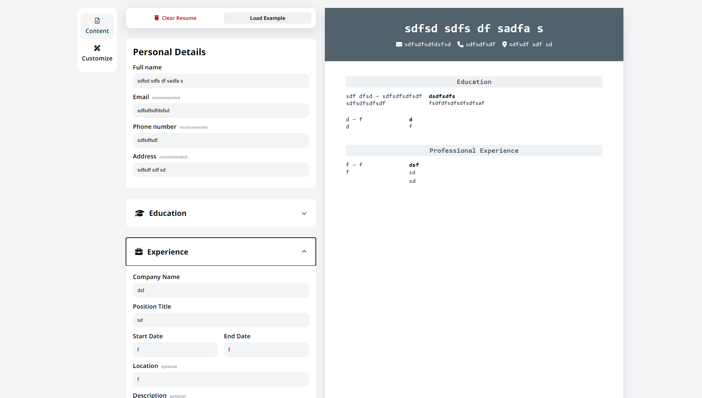

1. Create a new React project.

2. Think about how to structure your application into components. Your application should include:

   1. A section to add **_general information_** like name, email and phone number.

   ```jsx
   // General information
   <Form label='personal-info'>
       <Input type='name'>
       <Input type='email'>
       <Input type='phone'>
   <Form />
   ```

   2. A section to add your **_educational experience_** (school name, title of study and date of study)

   ```jsx
   // Education
   <Form label='education-experience'>
       <Input label='school-name'>
       <Input label='title-of-study'>
       <Input label='date-of-study'>
   <Form />
   ```

   3. A section to add **_practical experience_** (company name, position title, main responsibilities of your jobs, date from and until when you worked for that company)

   ```jsx
   // Job experience
   <Form label='job-experience'>
       <Input label='businness-name'>
       <Input label='title-of-job'>
       <Input label='duration'>
   <Form />
   ```

3. Be sure to include an **_edit and submit button for each section_** or for the whole CV. The **submit button should submit your form and display the value of your input fields in HTML elements**. The edit button should add back (display) the input fields, with the previously displayed information as values. In those input fields, you should be able to edit and resubmit the content. You’re going to make heavy use of state and props, so make sure you understood those concepts.

   1. On load, prompt for personal, then education, then job
   2. On accept, change state and show next fields
   3. Each form should update the rendered styled CV on-the-fly, and each form should have edit buttons, or maybe the rendered CV buttons on hover?
   4. Severla sections: show/hide, add/remove edit on touch [Perfect Example](https://sharkri.github.io/cv-application/)
      

```jsx
<App />
    <Form personal/>
        <Input {label, placeholder, optional/required} />
    <Form education/>
        <Input />
        <Input />
        .
        .
        <Button {save, remove}>
        <Button {show/hide}>
    <Form job/>
        <Input />
        <Input />
        .
        .
        <Button {save, remove}>
        <Button {show/hide}>
    <CVDisplay />
        <Header {name, phone etc}/>
        <CVSection title={education} />
        <CVSection title={professional experience} />
```
Data
- Inputs (text, dates, numbers)
    - onSave within a Form should change state and display
- Buttons (show/hide, save, delete)
State
- Since state is shared between forms and the display, it should be the App that manages state(s)

4. Create a components directory under your src directory and add your components.

5. Include a styles directory under your src directory for your CSS files. You’ll need to import these in the component files to use them.

6. Push the results and deploy them with any of the options mentioned below. At this point of the curriculum, it doesn’t matter which platform you choose as long as your project is live on the internet!
