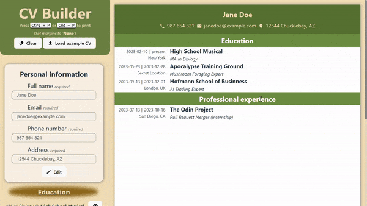

# CV Application (React)

## Overview

This project is a part of The Odin Project's React curriculum. As my first React project, I got more familiar with state and effect hooks, as well as how as the foundation of a React project's design.

The application uses [Vite](https://vitejs.dev/) as the build tool.

## Usage

Visit the project's site at [CV Builder]() by [_tostimontes_](https://github.com/tostimontes/)

## Key Features

- **State and Effect Hooks:** The application leverages React's state and effect hooks to manage and persist form data. This approach enables a dynamic and responsive user experience, where changes are reflected in real-time across the application.

- **Local Storage:** To enhance user experience and prevent data loss, the application uses local storage. This allows the form data to be saved and retrieved, making the application more robust and user-friendly.

- **App Component:** This is the main component of the application. It serves as the entry point and manages the overall state and logic of the CV building process.

- **Form Component:** This component is responsible for rendering individual forms for inputting personal, educational, and professional information. It's designed to be reusable and adaptable to various data structures.

- **CV Builder Usage:** The application is designed to be intuitive and user-friendly. Users can add, edit, hide, and delete sections for their personal information, educational background, and professional experience. The data entered is reflected in a preview section, giving users a live view of how their CV will look.

  - _Automatic sorting:_ CV elements are automatically sorted from newest to oldest.

- **Print Functionality:** A dedicated `print.css` file is included to ensure that only the CV display section is printed, omitting other UI elements. This feature allows users to easily print their CVs in a clean and professional format.

## Improvements

- **Responsiveness**: Enhancing the application's responsiveness to ensure an optimal viewing experience across various devices, including mobile phones, tablets, and desktop computers.

## Additional Features

- **Form Validation**: Implement more robust form validation to ensure data integrity and provide user feedback.
- **Customization Options**: Introduce the ability to customize the layout and design of the CV, including themes, fonts, and color schemes.
- **Export Options**: Besides printing, provide options to export the CV in various formats like PDF or Word document.
- **User Account Integration**: Allow users to create accounts to save and manage multiple CVs over time.
- **Accessibility**: Ensure that the application is accessible to all users, including those with disabilities, by adhering to web accessibility standards.
